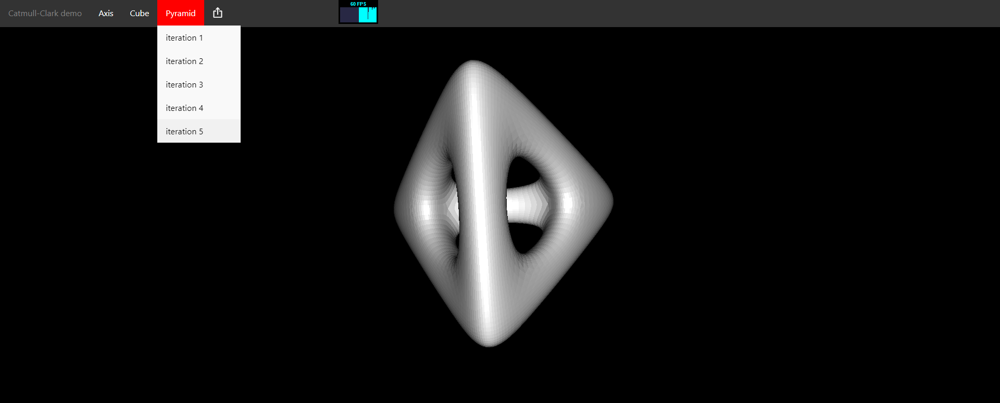

# react-catmull-clark-demo
This is a demonstrator for catmull-clark algorithm in react. Everything is computed at the client, no backend calculation involved.

A running demo is available online [https://michaelspitzer.at/catmull-clark](https://michaelspitzer.at/catmull-clark).

